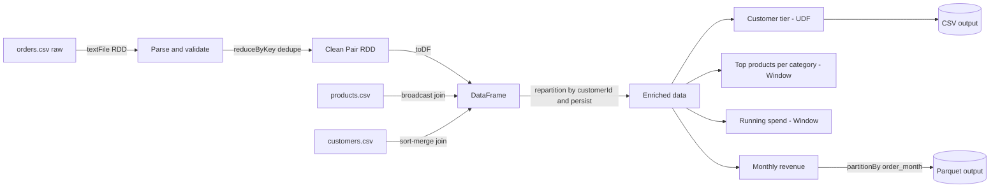

# Day 29: End-to-End E-Commerce Pipeline (Spark + Scala)

A production-style batch pipeline: **raw → clean → enrich → aggregate**.
It uses RDD / Pair RDD for ingestion and cleaning, and DataFrames for joins, windows and aggregations.

## Architecture



## Project structure

```
ecommerce-pipeline/
├── build.sbt
├── gen_data.py                  # generates dirty sample data
├── data/                        # orders.csv, customers.csv, products.csv
├── src/main/scala/EcommercePipeline.scala
├── docs/run_output.txt          # saved console output with explain() plans
└── README.md
```

## Pipeline stages

| Stage | API | What happens |
|---|---|---|
| Raw | RDD | `textFile` reads orders.csv, header removed |
| Clean | RDD / Pair RDD | Malformed rows dropped (missing id, negative qty, bad price), cancelled orders removed, duplicates removed by orderId |
| Enrich | DataFrame | Join with products (broadcast) and customers (sort-merge), derive month, revenue, normalised country |
| Aggregate | DataFrame | Customer tier, top 3 products per category, running spend per customer, monthly revenue |
| Write | Parquet / CSV | Monthly revenue partitioned by `order_month` |

## Design choices

- **RDD for cleaning**: row-level parsing and custom validation logic, plus a manual `HashPartitioner`.
- **DataFrame for enrichment and aggregation**: the Catalyst optimizer handles joins, windows and group-bys.
- **Only one UDF** (`tierUdf`): the GOLD/SILVER/BRONZE rule is custom business logic. Everything else uses built-in functions, because UDFs are opaque to Catalyst.

## Shuffles and stages

| # | Operation | Shuffle? | Reason |
|---|---|---|---|
| 1 | `reduceByKey` on orderId | Yes (stage boundary) | Same keys must meet to dedupe. Map-side combine reduces the data moved |
| 2 | `partitionBy(HashPartitioner(4))` | Yes | Co-locates product keys |
| 3 | `reduceByKey` after partitionBy | No | Same partitioner, so it is a narrow dependency |
| 4 | `join(broadcast(products))` | No | Small table is sent to every executor (BroadcastHashJoin) |
| 5 | `join(customers)` | Yes | SortMergeJoin: both sides are exchanged by key |
| 6 | `repartition(8, customerId)` | Yes | Done once and reused by later groupBy and window |
| 7 | Window by category | Yes | `Exchange hashpartitioning(category)` |
| 8 | Window by customerId | No | Data is already partitioned by customerId |

Each shuffle splits the job into a new stage. Operations like `map`, `filter`, `flatMap` are narrow and stay in the same stage.

## Optimizations

- `persist(MEMORY_AND_DISK)` on the cleaned RDD (used by two actions) and the enriched DataFrame (used by four aggregations). Both are unpersisted at the end.
- Broadcast join for the small products table avoids shuffling the large orders data.
- `spark.sql.shuffle.partitions = 8` instead of the default 200, because the data is small.
- Output written as Parquet partitioned by `order_month`, which enables partition pruning.
- Auto-broadcast and AQE are disabled only in this demo to keep plans readable. In production, enable AQE.

## How to run

Requirements: JDK 17, sbt, Python 3.

```bash
python3 gen_data.py
sbt run
```

While the job runs, the Spark UI is at http://localhost:4040 (Stages tab shows the shuffle boundaries).

## Results

Replace these numbers with your own from `docs/run_output.txt`.

- Raw rows: about 5100
- Clean orders after validation, cancel filter and dedupe: <your number>
- Top product by revenue: <your product>
- Output: `output/monthly_revenue/` (Parquet) and `output/customer_tier/` (CSV)

## Possible improvements

- Read from a data lake (S3 / HDFS) instead of local CSV.
- Add unit tests for the `parse` function.
- Enable AQE and tune partitions based on real data volume.
