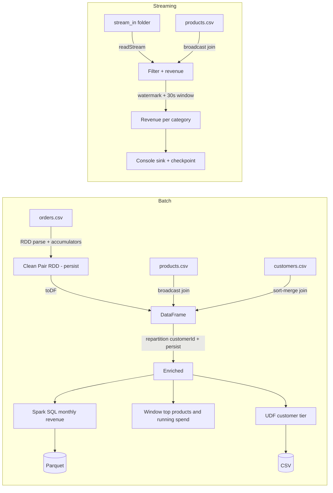

# Day 30: Final Capstone, E-Commerce Batch + Streaming (Spark + Scala)

Domain: **E-commerce**. One batch job and one streaming job built on the same data model.

## Architecture



## Requirement coverage

| Requirement | Implementation |
|---|---|
| Batch + streaming | `CapstoneBatch.scala`, `CapstoneStreaming.scala` |
| Broadcast | products table in both jobs |
| Accumulator | `badRows`, `cancelledRows` |
| Cache / persist | `MEMORY_AND_DISK` on clean RDD and enriched DataFrame |
| Partition tuning | `shuffle.partitions`, `repartition`, `coalesce` |
| Spark SQL, joins, aggregations, windows | temp view query, broadcast and sort-merge joins, dense_rank, running sum |
| UDF | `tierUdf` (GOLD / SILVER / BRONZE) |
| DAG, lineage, stages, executors, YARN | [docs/DAG_AND_YARN.md](docs/DAG_AND_YARN.md) |
| 20 interview questions | [docs/INTERVIEW_QA.md](docs/INTERVIEW_QA.md) |

## How to run

Requirements: JDK 17, sbt, Python 3.

```bash
# batch
sbt "runMain CapstoneBatch"

# streaming (generator in background, job stops after 80 seconds)
rm -rf stream_in checkpoint
python3 stream_gen.py &
sbt "runMain CapstoneStreaming"
```

Spark UI while running: http://localhost:4040

## Outputs

- `docs/batch_output.txt`: batch console output with lineage and explain plans
- `docs/stream_output.txt`: streaming micro-batch output
- `output/monthly_revenue/` (Parquet), `output/customer_tier/` (CSV)
